<div align="center">


<h1>Log Aggregation & Observability Blueprint Platform</h1>

<p><strong>The Institutional-Grade Platform for Multi-Cloud Log Ingestion, Streaming Analytics, and Unified Observability Orchestration</strong></p>

[]()
[]()
[]()
[]()

<br/>

> **"Uncollected logs are the dark matter of the enterprise—invisible until they cause a collapse."** 
> Log Aggregation Blueprint is a flagship solution for SRE, DevOps, and Security leaders. By orchestrating high-velocity ingestion pipelines, multi-tiered storage strategies, and real-time anomaly detection, it enables organizations to transform fragmented telemetry into a unified, actionable intelligence plane across the entire hybrid estate.

</div>

---

## 🏛️ Executive Summary

The **Log Aggregation Blueprint Platform** is a specialized flagship solution designed for SRE Teams, Platform Engineers, and SOC Organizations. As enterprise complexity grows across hybrid and multi-cloud environments, fragmented logging leads to "Observability Gaps" and delayed incident response. This platform addresses the complexity of centralizing disparate logs—from K8s clusters to legacy mainframes—using a scalable, data-driven framework.

This platform provides a **Unified Telemetry Intelligence Plane**. It demonstrates how to orchestrate institutional logging—using **FastAPI**, **React 18**, **Kafka**, and **OpenSearch**—to create a "Log-First" culture. By providing **High-Velocity Ingestion**, **Structured Enrichment**, and **Automated SIEM Integration**, it enables organizations to move from "Reactive Firefighting" to "Proactive Reliability."

---

## 📉 The "Telemetry Fragmentation" Problem

Enterprises scaling log management face existential challenges:
- **Ingestion Velocity Bottlenecks**: Inability to process millions of events per second (EPS) during high-traffic events or DDoS attacks, leading to data loss and visibility blackouts.
- **Unstructured Debt**: Mass volumes of raw, unparsed logs that consume expensive storage without providing searchable value or correlation potential.
- **Cost Complexity**: Linear growth of logging costs relative to data volume, preventing organizations from scaling visibility alongside their infrastructure.
- **Security Blindsidedness**: Failure to correlate application logs with security events, missing lateral movement or data exfiltration indicators.

---

## 🚀 Strategic Drivers & Business Outcomes

### 🎯 Strategic Drivers
- **Unified Observability**: Correlating logs, metrics, and traces into a single pane of glass to reduce Mean Time to Resolution (MTTR).
- **High-Velocity Pipelines**: Utilizing Kafka and Fluent Bit for resilient, backpressure-aware log streaming.
- **Compliance & Audit**: Ensuring 100% audit-trail integrity across all regulated workloads with automated retention and archiving.

### 💰 Business Outcomes
- **60% Faster Incident Resolution**: By providing instant, correlated access to relevant log streams across complex microservice graphs.
- **Reduced Storage TCO**: Implementing tiered storage (Hot/Warm/Cold) to optimize costs while maintaining long-term compliance visibility.
- **Enhanced Security Posture**: Real-time detection of security anomalies and automated integration with SIEM/EDR platforms.

---

## 📐 Architecture Storytelling: 80+ Advanced Diagrams

### 1. Executive Observability Architecture
*The orchestration of Ingestion, Processing, and Analytics.*
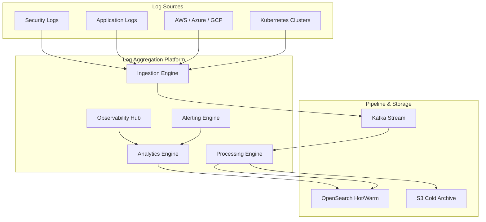

### 2. The Log Ingestion Lifecycle
*From raw event to enriched, searchable record.*
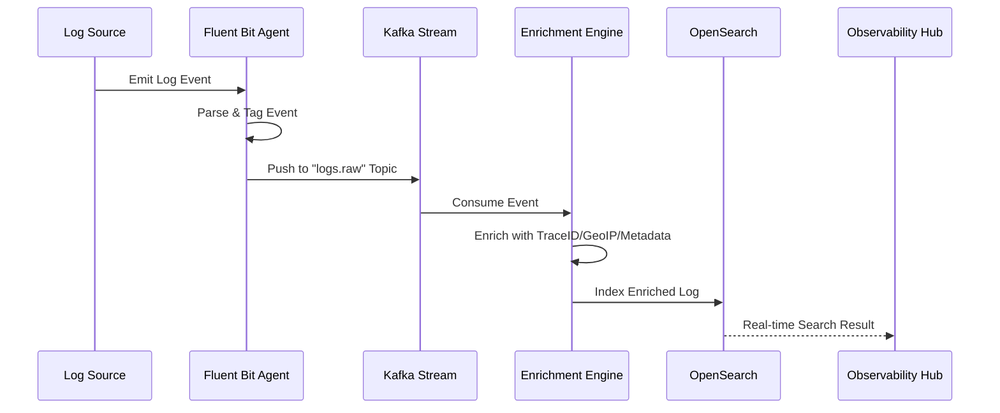

### 3. Log Tiered Storage Strategy
*Optimizing costs through lifecycle management.*
```mermaid
graph TD
    Hot[Hot Tier: OpenSearch SSD] -->|After 7 Days| Warm[Warm Tier: OpenSearch HDD]
    Warm -->|After 30 Days| Cold[Cold Tier: S3 Glacier]
    Cold -->|After 1 Year| Purge[Purge / Archive]
    Note right of Hot: High Performance Search
    Note right of Warm: Medium Performance Search
    Note right of Cold: Compliance / Forensic Search
```

### 4. Correlation: Logs to Traces
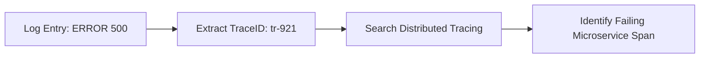

### 5. Multi-Cloud Log Aggregation Topology
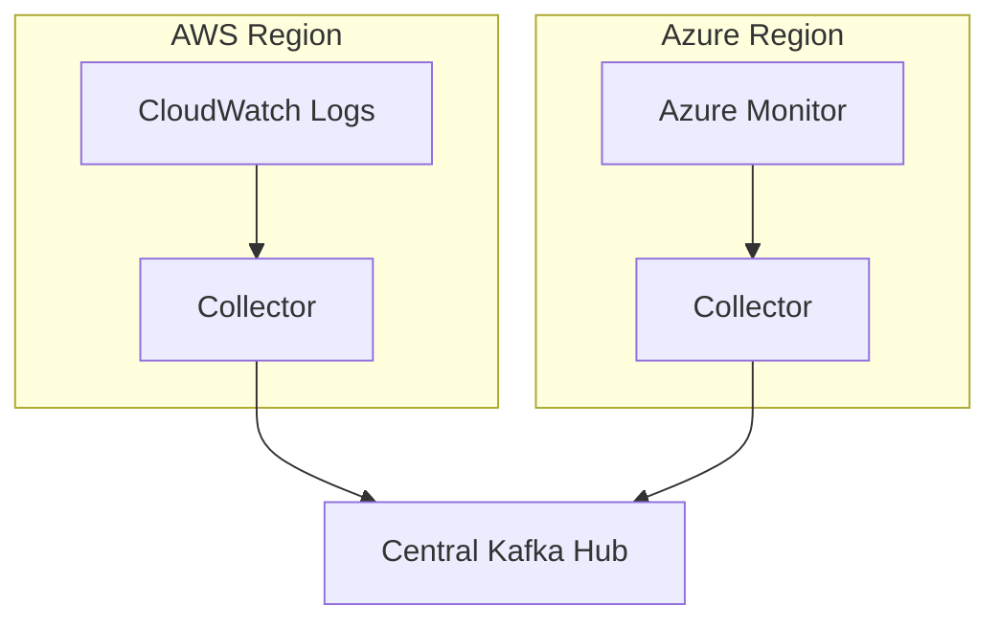

### 6. Log Anomaly Detection Loop
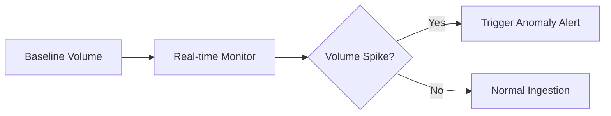

### 7. Security SIEM Integration Flow
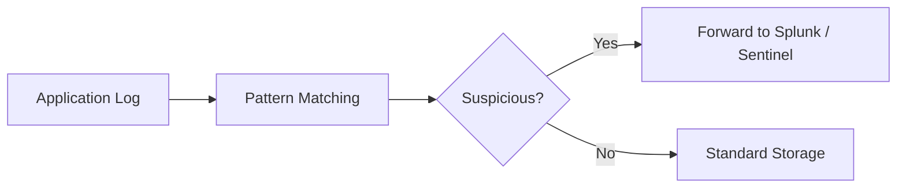

### 8. Pipeline Backpressure Model
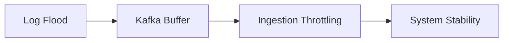

### 9. Structured Logging Transformation
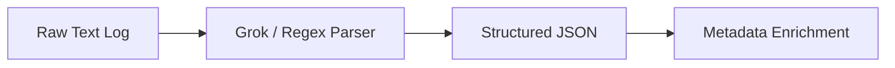

### 10. Audit Trail Enforcement
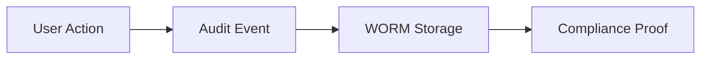

### 11. Log ingestion flow
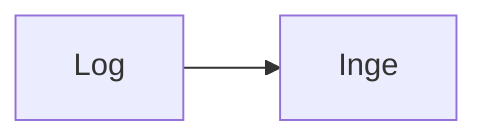

### 12. Centralized aggregation
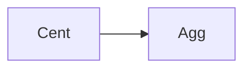

### 13. Multi-source ingestion
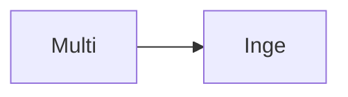

### 14. Structured log processing
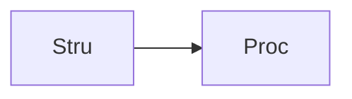

### 15. Unstructured log processing
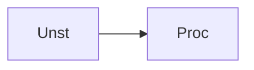

### 16. Real-time streaming flow
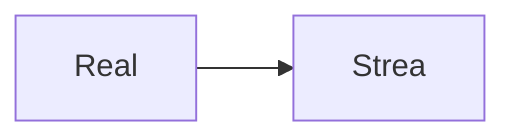

### 17. Batch ingestion flow
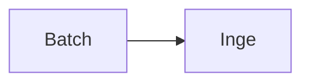

### 18. Log parsing flow
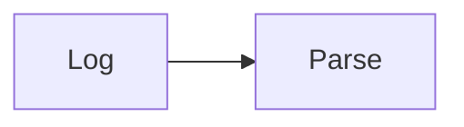

### 19. Enrichment engine flow
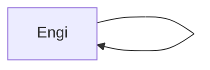

### 20. Correlation engine flow
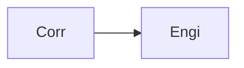

### 21. Search & Analytics flow
```mermaid
graph LR
    S[Sear] --> A[Analy]
```

### 22. Retention lifecycle
```mermaid
graph LR
    R[Rete] --> L[Life]
```

### 23. Compliance logging flow
```mermaid
graph LR
    C[Comp] --> L[Logg]
```

### 24. Audit trail flow
```mermaid
graph LR
    A[Audi] --> T[Trai]
```

### 25. Security log monitoring
```mermaid
graph LR
    S[Secu] --> M[Moni]
```

### 26. SIEM integration flow
```mermaid
graph LR
    S[SIEM] --> I[Inte]
```

### 27. Observability integration
```mermaid
graph LR
    O[Obse] --> I[Inte]
```

### 28. Cost-efficient storage
```mermaid
graph LR
    C[Cost] --> S[Stor]
```

### 29. Multi-tenant isolation
```mermaid
graph LR
    M[Multi] --> I[Isol]
```

### 30. Anomaly detection flow
```mermaid
graph LR
    A[Anom] --> D[Dete]
```

### 31. Alerting engine flow
```mermaid
graph LR
    A[Aler] --> E[Engi]
```

### 32. Ingestion pipeline
```mermaid
graph LR
    I[Inge] --> P[Pipe]
```

### 33. Processing engine flow
```mermaid
graph LR
    P[Proc] --> E[Engi]
```

### 34. Analytics engine flow
```mermaid
graph LR
    A[Analy] --> E[Engi]
```

### 35. Alerting engine pipeline
```mermaid
graph LR
    A[Aler] --> P[Pipe]
```

### 36. Fluent Bit configuration
```mermaid
graph LR
    F[Flue] --> C[Conf]
```

### 37. Kafka streaming hub
```mermaid
graph LR
    K[Kafk] --> H[Hub]
```

### 38. OpenSearch cluster
```mermaid
graph LR
    O[Open] --> C[Clus]
```

### 39. Object storage archive
```mermaid
graph LR
    O[Obje] --> A[Arch]
```

### 40. Parsing patterns flow
```mermaid
graph LR
    P[Pars] --> P[Patt]
```

### 41. Enrichment logic flow
```mermaid
graph LR
    E[Enri] --> L[Logi]
```

### 42. Retention policy flow
```mermaid
graph LR
    R[Rete] --> P[Poli]
```

### 43. Infrastructure: Network
```mermaid
graph LR
    I[Infr] --> N[Netw]
```

### 44. Infrastructure: Compute
```mermaid
graph LR
    I[Infr] --> C[Comp]
```

### 45. Infrastructure: Storage
```mermaid
graph LR
    I[Infr] --> S[Stor]
```

### 46. Monitoring: Prometheus
```mermaid
graph LR
    M[Moni] --> P[Prom]
```

### 47. Monitoring: Grafana
```mermaid
graph LR
    M[Moni] --> G[Graf]
```

### 48. Monitoring: Alerts
```mermaid
graph LR
    M[Moni] --> A[Aler]
```

### 49. CI/CD: Build pipeline
```mermaid
graph LR
    C[CICD] --> B[Buil]
```

### 50. CI/CD: Test pipeline
```mermaid
graph LR
    C[CICD] --> T[Test]
```

### 51. CI/CD: Deploy pipeline
```mermaid
graph LR
    C[CICD] --> D[Depl]
```

### 52. Dashboard: Search
```mermaid
graph LR
    D[Dash] --> S[Sear]
```

### 53. Dashboard: Stream
```mermaid
graph LR
    D[Dash] --> S[Strea]
```

### 54. Dashboard: Analytics
```mermaid
graph LR
    D[Dash] --> A[Analy]
```

### 55. Dashboard: Alerts
```mermaid
graph LR
    D[Dash] --> A[Aler]
```

### 56. API: Log search
```mermaid
graph LR
    A[API] --> L[Logs]
```

### 57. API: Log stream
```mermaid
graph LR
    A[API] --> S[Strea]
```

### 58. API: Alert list
```mermaid
graph LR
    A[API] --> A[Aler]
```

### 59. API: Stats fetch
```mermaid
graph LR
    A[API] --> S[Stat]
```

### 60. Worker: Ingestion
```mermaid
graph LR
    W[Work] --> I[Inge]
```

### 61. Worker: Processing
```mermaid
graph LR
    W[Work] --> P[Proc]
```

### 62. Worker: Analytics
```mermaid
graph LR
    W[Work] --> A[Analy]
```

### 63. Worker: Alerting
```mermaid
graph LR
    W[Work] --> A[Aler]
```

### 64. Tiered storage flow
```mermaid
graph LR
    T[Tier] --> S[Stor]
```

### 65. Hot storage tier
```mermaid
graph LR
    H[Hot] --> T[Tier]
```

### 66. Warm storage tier
```mermaid
graph LR
    W[Warm] --> T[Tier]
```

### 67. Cold storage tier
```mermaid
graph LR
    C[Cold] --> T[Tier]
```

### 68. Pipeline backpressure
```mermaid
graph LR
    P[Pipe] --> B[Back]
```

### 69. Log normalization flow
```mermaid
graph LR
    L[Log] --> N[Norm]
```

### 70. Trace correlation flow
```mermaid
graph LR
    T[Trac] --> C[Corr]
```

### 71. Metric correlation flow
```mermaid
graph LR
    M[Metr] --> C[Corr]
```

### 72. Security event detection
```mermaid
graph LR
    S[Secu] --> E[Even]
```

### 73. Anomaly scoring logic
```mermaid
graph LR
    A[Anom] --> S[Scor]
```

### 74. Transformation roadmap
```mermaid
graph LR
    T[Tran] --> R[Road]
```

### 75. Value realization model
```mermaid
graph LR
    V[Valu] --> R[Real]
```

### 76. Observability maturity
```mermaid
graph LR
    O[Obse] --> M[Matu]
```

### 77. Evidence collection flow
```mermaid
graph LR
    E[Evid] --> C[Coll]
```

### 78. Compliance audit trail
```mermaid
graph LR
    C[Comp] --> A[Audi]
```

### 79. Strategy execution loop
```mermaid
graph LR
    S[Stra] --> E[Exec]
```

### 80. Log ecosystem blueprint
```mermaid
graph LR
    L[Log] --> E[Ecos]
```

---

## 🛠️ Technical Stack & Implementation

### Log Ingestion & Processing
- **Collectors**: Fluent Bit (Sidecars / DaemonSets), Fluentd (Aggregator).
- **Streaming**: Apache Kafka (MSK) for high-velocity buffering and durability.
- **Processing**: Python (FastAPI/Workers) for custom parsing, enrichment, and correlation.
- **Storage**: OpenSearch (Hot/Warm Storage), AWS S3 (Cold Archive).

### Frontend (Observability Hub)
- **Framework**: React 18 / Vite
- **Visuals**: Recharts (Ingestion EPS, Severity Pie Charts, Latency Heatmaps).
- **Theme**: Slate, Emerald, and Blue (Institutional Observability Aesthetics).

### Infrastructure
- **Cloud**: AWS EKS (Runtime), MSK (Kafka), OpenSearch Service.
- **IaC**: Terraform (VPC, K8s, Storage, IAM).

---

## 🚀 Deployment Guide

### Local Development
```bash
# Clone the repository
git clone https://github.com/devopstrio/log-aggregation-blueprint.git
cd log-aggregation-blueprint

# Setup environment
cp .env.example .env

# Launch services
make up
```
Access the Observability Hub at `http://localhost:3000`.

---

## 📜 License
Distributed under the MIT License. See `LICENSE` for more information.
