<div align="center">


<h1>Log Aggregation Blueprint</h1>

<p><strong>The Institutional-Grade Platform for Multi-Cloud Log Ingestion, Streaming Analytics, and Unified Observability Orchestration.</strong></p>

[]()
[]()
[]()

<br/>

> **"Uncollected logs are the dark matter of the enterprise—invisible until they cause a collapse."** 
> **Log Aggregation Blueprint** is an enterprise-grade platform designed to provide a secure, measurable, and highly automated foundation for global observability. It orchestrates the complex lifecycle of log data—from high-throughput collection and edge-based PII scrubbing to tiered retention and unified telemetry governance.

</div>

---

## 🏛️ Executive Summary

Fragmented log streams and manual log rotation processes are strategic operational liabilities; lack of centralized telemetry orchestration is a primary barrier to organizational incident response speed. Organizations fail to achieve deep observability not because of a lack of logs, but because of fragmented data standards, lack of automated edge processing, and an inability to orchestrate telemetry assets with operational precision.

This platform provides the **Telemetry Intelligence Plane**. It implements a complete **Enterprise Logging-as-Code Framework**, enabling SRE and Platform teams to manage global log lifecycles as first-class citizens. By automating the scrubbing of sensitive PII data at the edge and orchestrating real-time tiered storage transitions, we ensure that every organizational event—from critical application errors to routine security audits—is captured by default, audited for history, and strictly aligned with institutional observability frameworks.

---

## 📐 Architecture Storytelling: Principal Reference Models

### 1. Principal Architecture: Global Log Aggregation & Telemetry Intelligence Plane
This diagram illustrates the end-to-end flow from multi-source log collection and high-throughput transport to PII scrubbing, tiered indexing, and institutional telemetry auditing.

```mermaid
graph LR
    %% Subgraph Definitions
    subgraph LogSources["Log Source Ingress"]
        direction TB
        K8sLogs["K8s Cluster Logs"]
        AppLogs["Application JSON Logs"]
        SysLogs["Legacy System Logs"]
    end

    subgraph IntelligenceEngine["Telemetry Intelligence Hub"]
        direction TB
        API["FastAPI Logging Gateway"]
        Scrubber["PII & Sensitive Data Scrub"]
        Indexer["Tiered Index Orchestrator"]
        AuditEngine["Forensic Audit Logger"]
    end

    subgraph TransportationPlane["Distributed Transport Fleet"]
        direction TB
        Fluentd["Fluentd / Logstash Clusters"]
        Kafka["Kafka / Kinesis Buffers"]
        Transform["Normalization Workers"]
    end

    subgraph OperationsHub["Institutional Telemetry Hub"]
        direction TB
        Scorecard["Logging Maturity Score"]
        Analytics["EPS & Ingestion Stats"]
        Audit["Forensic Log Metadata Lake"]
    end

    subgraph DevOps["Logging-as-Code Orchestration"]
        direction TB
        TF["Terraform Logging Modules"]
        Retention["Storage Lifecycle Policy"]
        ChatOps["Anomaly Approval Hub"]
    end

    %% Flow Arrows
    LogSources -->|1. Stream Events| Fluentd
    Fluentd -->|2. Buffer Events| Kafka
    Kafka -->|3. Norm & Enrich| Transform
    Transform -->|4. Forward to Hub| API
    
    API -->|5. Scrub PII| Scrubber
    Scrubber -->|6. Index Logs| Indexer
    API -->|7. Visualize Health| Scorecard
    
    Scorecard -->|8. Track EPS| Analytics
    Scorecard -->|9. Record Query| Audit
    
    TF -->|10. Provision Hub| IntelligenceEngine
    Retention -->|11. Tier Storage| Indexer
    Audit -->|12. Improve Parsing| Fluentd

    %% Styling
    classDef ingress fill:#f5f5f5,stroke:#616161,stroke-width:2px;
    classDef intel fill:#e8f5e9,stroke:#2e7d32,stroke-width:2px;
    classDef transport fill:#e1f5fe,stroke:#01579b,stroke-width:2px;
    classDef ops fill:#ede7f6,stroke:#311b92,stroke-width:2px;
    classDef devops fill:#fffde7,stroke:#f57f17,stroke-width:2px;

    class LogSources ingress;
    class IntelligenceEngine intel;
    class TransportationPlane transport;
    class OperationsHub ops;
    class DevOps devops;
```

### 2. The Log Lifecycle Flow
The continuous path of a log event from initial collection and transport to active transformation, indexing, archiving, and institutional forensic auditing.

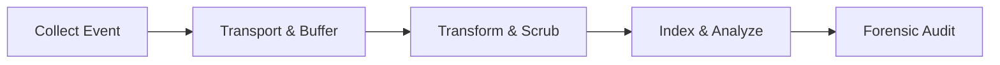

### 3. High-Throughput Ingestion Topology
Scaling Logstash and Fluentd clusters strategically to handle bursty telemetry traffic without data loss, providing a unified institutional entry point for all log streams.

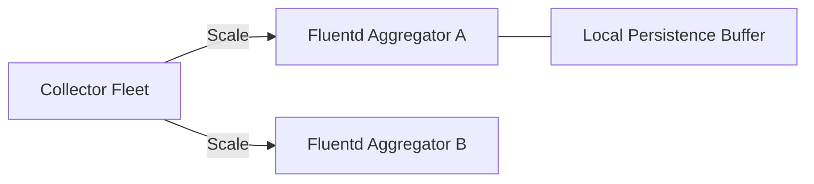

### 4. Distributed Log Transportation & Buffering Flow
Utilizing Apache Kafka or Kinesis as a distributed, persistent buffer between collectors and indexers, preventing data loss during massive traffic spikes or backend maintenance.

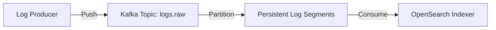

### 5. PII Masking & Data Scrubbing Flow
Automatically identifying and redacting sensitive data (Credit Cards, SSNs, Passwords) at the edge before storage, ensuring institutional data privacy compliance by default.

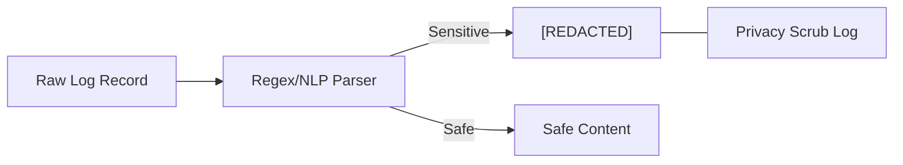

### 6. Tiered Log Retention & Cold Storage Flow
Strategically moving logs between Hot (OpenSearch), Warm (S3), and Cold (Glacier) storage tiers based on age and compliance requirements, optimizing institutional storage TCO.

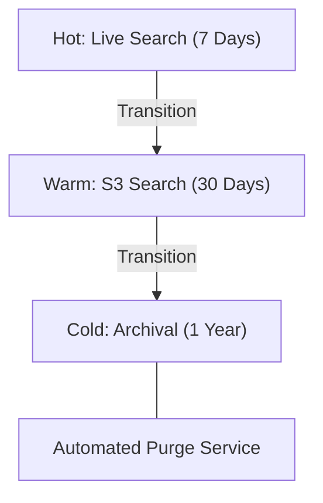

### 7. Institutional Logging Maturity Scorecard
Grading organizational performance based on key indicators: Log Ingestion Latency, Search Query Speed, and Ingestion-to-Search Success Rate.

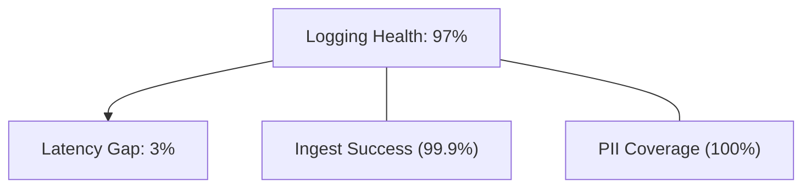

### 8. Identity & RBAC for Log Governance
Managing fine-grained access to sensitive application logs, security events, and audit histories between Security Auditors, DevOps Engineers, and Developers.

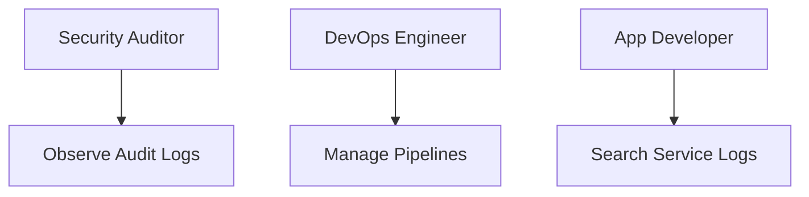

### 9. IaC Deployment: Logging-as-Code Framework
Using modular Terraform to deploy and manage the versioned distribution of the log tracking hubs, collector clusters, and forensic metadata lakes.

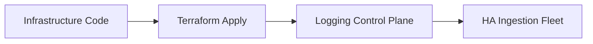

### 10. AIOps Log Anomaly & Volume Spike Validation Flow
Using advanced analytics to identify unusual log volume spikes ("Log Spam") or "Silent Failures" (abrupt cessation of log flow) across the enterprise estate.

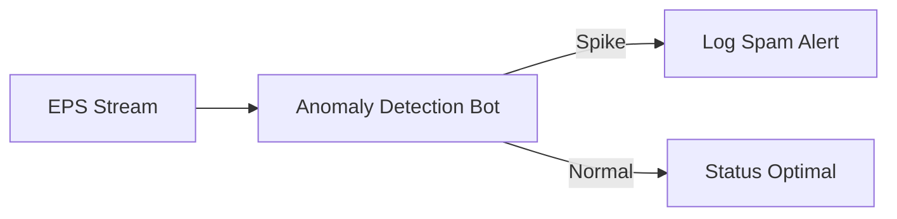

### 11. Metadata Lake for Forensic Log Audit
Storing long-term records of every log ingestion event, every search query executed, and every access grant for institutional record-keeping and forensic auditing.

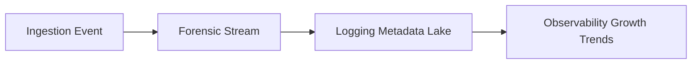

---

## 🏛️ Core Logging Pillars

1.  **Unified Telemetry Ingestion**: Maximizing visibility by centralizing all log streams through a single institutional plane.
2.  **High-Resilience Buffering**: Guaranteeing zero-data-loss through distributed, persistent message transport.
3.  **Edge-Based Data Privacy**: Enforcing PII scrubbing and data masking at the point of ingestion.
4.  **Cost-Optimized Retention**: Minimizing storage TCO through automated, tiered lifecycle management.
5.  **Autonomous Anomaly Detection**: Identifying production issues before they impact users through real-time volume analysis.
6.  **Full Telemetry Auditability**: Immutable recording of every log access and transformation event for institutional forensics.

---

## 🛠️ Technical Stack & Implementation

### Logging Engine & APIs
*   **Framework**: Python 3.11+ / FastAPI.
*   **Collection Core**: Fluent Bit sidecars with Fluentd central aggregators.
*   **Transport Hub**: Apache Kafka (MSK) or Kinesis for persistent buffering.
*   **Persistence**: OpenSearch (Hot/Warm Storage) and AWS S3 (Cold Archive).
*   **Auth Orchestrator**: Federated OIDC/SAML for least-privilege log access.

### Observability Dashboard (UI)
*   **Framework**: React 18 / Vite.
*   **Theme**: Dark, Emerald, Slate (Modern high-fidelity observability aesthetic).
*   **Visualization**: Recharts for ingestion throughput (EPS), search latency, and anomaly heatmaps.

### Infrastructure & DevOps
*   **Runtime**: AWS EKS or Azure Kubernetes Service (AKS).
*   **Storage Plane**: Multi-region S3 buckets for long-term forensic compliance.
*   **IaC**: Modular Terraform for deploying the logging landing zone and collector fleet.

---

## 🏗️ IaC Mapping (Module Structure)

| Module | Purpose | Real Services |
| :--- | :--- | :--- |
| **`infrastructure/log_hub`** | Central management plane | EKS, OpenSearch, Kafka |
| **`infrastructure/collectors`** | Edge collection fleet | Fluent Bit, Fluentd |
| **`infrastructure/storage`** | Tiered retention plane | S3, Glacier, Lifecycle |
| **`infrastructure/auditing`** | Forensic logging sinks | S3, Athena, Quicksight |

---

## 🚀 Deployment Guide

### Local Principal Environment
```bash
# Clone the logging platform
git clone https://github.com/devopstrio/log-aggregation-blueprint.git
cd log-aggregation-blueprint

# Configure environment
cp .env.example .env

# Launch the Logging stack
make init

# Trigger a mock log ingestion and anomaly detection simulation
make simulate-logging
```

Access the Observability Hub at `http://localhost:3000`.

---

## 📜 License
Distributed under the MIT License. See `LICENSE` for more information.

---
<div align="center">
  <p>© 2026 Devopstrio. All rights reserved.</p>
</div>
