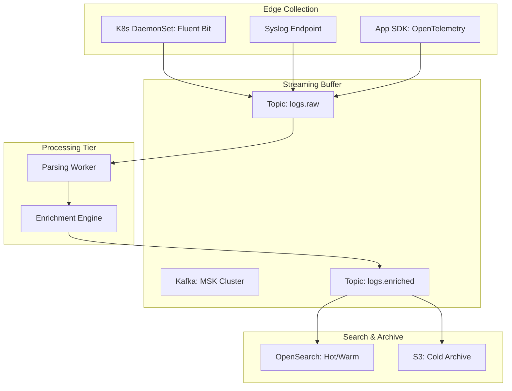
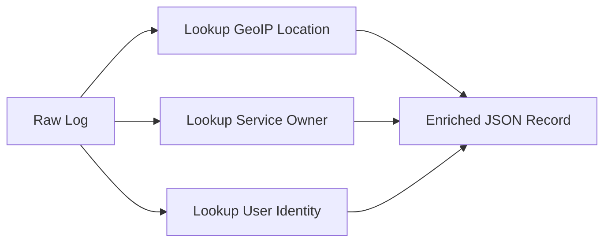
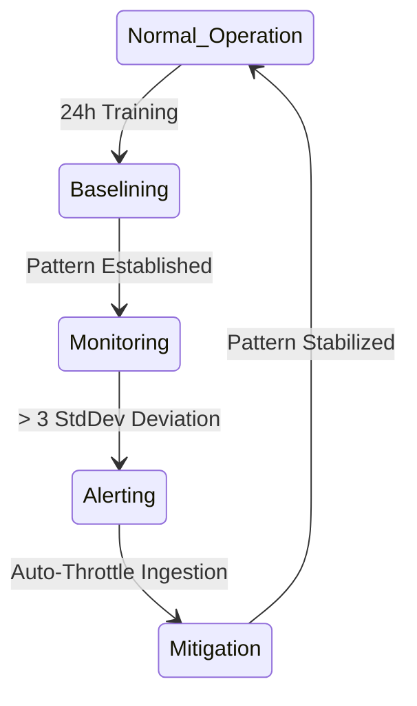

# Architecture & Pipeline Diagrams

## 11. End-to-End Log Pipeline (Detailed)
*How logs flow from source to long-term storage.*

## 13. "Log Enrichment" Data Flow

## 20. Anomaly Detection State Machine

