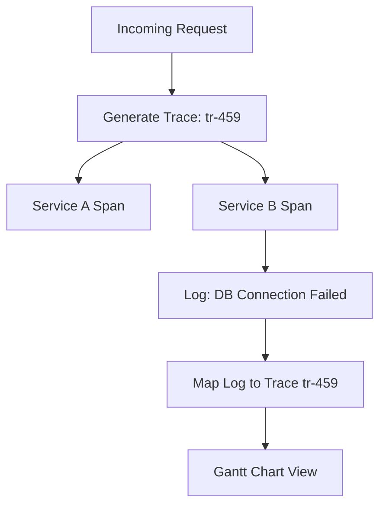
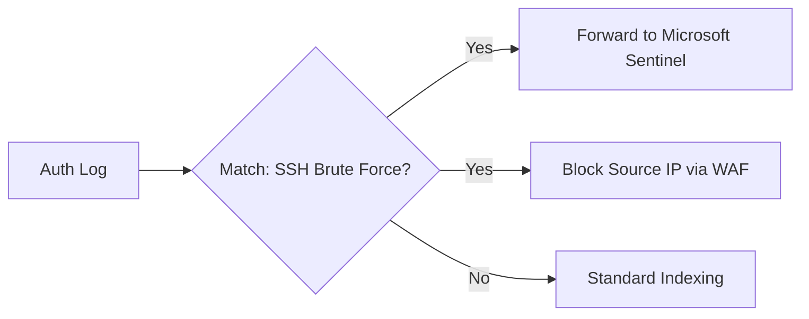
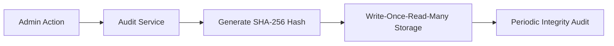

# Observability & Security Diagrams

## 31. Distributed Tracing Correlation

```mermaid
graph TD
    Request[Incoming Request] --> TraceID[Generate Trace: tr-459]
    TraceID --> Span1[Service A Span]
    TraceID --> Span2[Service B Span]
    Span2 --> Error[Log: DB Connection Failed]
    Error --> Correlation[Map Log to Trace tr-459]
    Correlation --> Visualization[Gantt Chart View]
```

## 34. Security "Pattern Matcher" Flow

```mermaid
graph LR
    Log[Auth Log] --> Matcher{Match: SSH Brute Force?}
    Matcher -->|Yes| SIEM[Forward to Microsoft Sentinel]
    Matcher -->|Yes| PIM[Block Source IP via WAF]
    Matcher -->|No| Store[Standard Indexing]
```

## 40. "Compliance" Audit Log Vault

```mermaid
graph LR
    Admin[Admin Action] --> Audit[Audit Service]
    Audit --> Hash[Generate SHA-256 Hash]
    Hash --> WORM[Write-Once-Read-Many Storage]
    WORM --> Verification[Periodic Integrity Audit]
```
